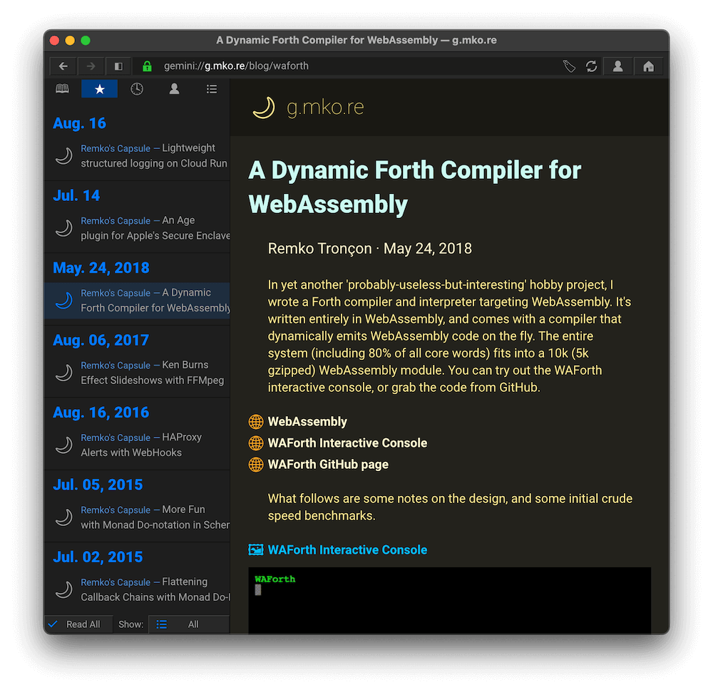
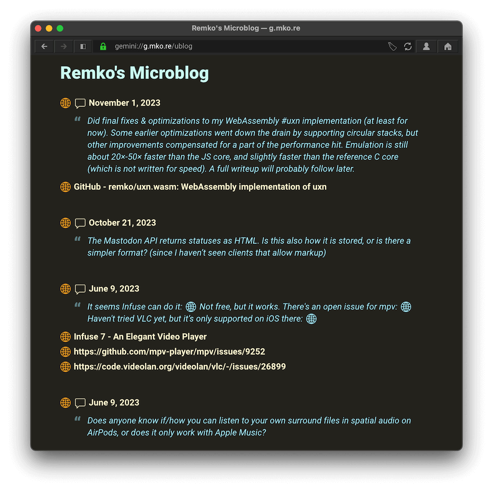
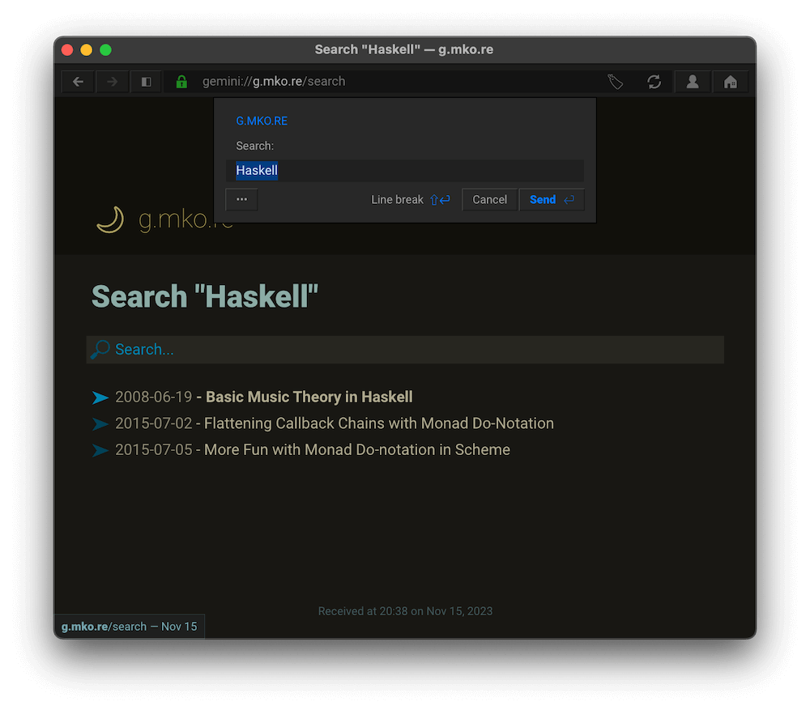

# Remko's Gemini Capsule

This repository contains the content and the server for [my Gemini
capsule](gemini://g.mko.re).

Both the server and the builder are written in Go, and don't have any
dependencies (except for the Go standard library)

The [capsule builder](https://github.com/remko/gemsite/blob/main/cmd/buildgemsite/buildgemsite.go) converts Markdown to Gemtext using a simple conversion (without needing a full Markdown parser), and packages everything into a single, self-contained server binary.

The [capsule server](https://github.com/remko/gemsite/blob/main/gemsite.go) supports:

- Serving static files
- Search
- Microblog, dynamically fetched from Mastodon
- Administration operations (e.g. collecting a CPU profile) using TLS Client Certificate
  authentication

# Ops

## Initializing

Create a server key and certificate:

    make server.crt

Create an admin user certificate:

    make admin.crt

## Building

    make

To cross-compile it to a Raspberry PI:

    make BUILD_RPI=1

## Installing (Debian/Raspbian)

- Install in `/opt/gemsite`
- Create link to `/opt/gemsite/init/gemsite.service` in
  `/etc/systemd/system/gemsite.service`
- `systemctl daemon-reload`
- `systemctl enable gemsite`
- `service gemsite start`

## Check status/logs

    journalctl -f -n 50 -u gemsite

## Restart

    systemctl restart gemsite
